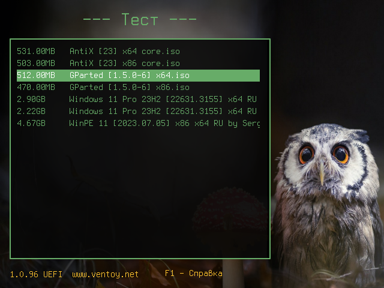

# my-ventoy-config

My simple theme for Ventoy. Based on the [Shodan](https://www.gnome-look.org/p/1251112) theme.

## Fonts

In `ventoy.json` imported only basic font sizes. The rest fonts are [here](./all-fonts).
